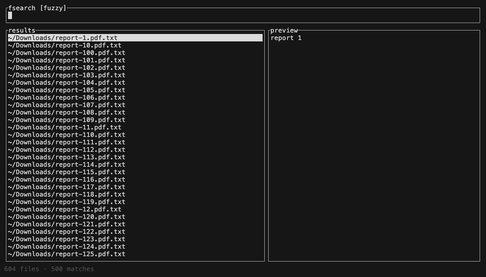

# fsearch

[](https://github.com/joshwhiteley/fsearch/actions/workflows/ci.yml)
[](LICENSE)

Fast file search for your Mac, in the terminal. Type to fuzzy-find any file
under your home folder, hit enter to open it. Inspired by Alfred.



fsearch keeps a persisted index of every file under your home directory —
hidden files included — and filters it as you type. Previews are
syntax-highlighted; images (PNG, JPEG, TIFF, GIF, WebP, SVG…) render right
in the terminal. Results are sorted by last modified and by what you
actually open, and the index updates live as files change on disk — no
re-scanning, no staleness. Works on macOS and Linux.

## Install

```sh
cargo install --path .
```

Homebrew and prebuilt binaries land with the first tagged release.

## Use

Run `fsearch` and start typing.

- plain text — fuzzy search on file names, matches highlighted
- `ctrl-r` — regex on the full path
- `> pattern` — regex search inside files, streamed as `path:line`
- `enter` opens · `ctrl-f` reveals in Finder · `ctrl-y` copies the path ·
  `tab` toggles preview · `esc` quits

Scripting: `fsearch -p QUERY` prints matches to stdout (exit 1 when none),
so it composes with pipes. `fsearch --help` lists everything else.

The first run indexes your home folder; later launches load the cached
index in milliseconds and refresh it in the background.

## Speed

Measured on an Apple-silicon MacBook over a real home directory of
**1.69 million files** (`tests/perf_test.rs` and hyperfine; your numbers
will vary):

| operation | time |
|---|---|
| fuzzy match, 1M paths (per keystroke) | ~15 ms |
| regex match, 1M paths (per keystroke) | ~11 ms |
| full re-index of 1.69M files | ~10–14 s |
| one-shot `fsearch -p query` (loads index, searches, prints) | ~250 ms |

Honest comparison: `mdfind` (Spotlight) answers one-shot queries in ~17 ms
because its daemon already holds an index in RAM — when it has one. On the
benchmark machine `mdfind -name readme` returned **0 results** while
fsearch found 500: Spotlight doesn't index hidden files or many dev trees,
and its coverage silently depends on per-volume indexing state. fsearch's
index is yours: predictable, inspectable, rebuildable with `--reindex`.

## When to use something else

- **fzf / television** — you want to fuzzy-filter arbitrary lists (git
  files, history, stdin) with deep shell integration. fsearch only does
  files-on-disk, by design.
- **Spotlight / Alfred / Raycast** — you want app launching, calculators,
  and OS integration. fsearch only searches files, in a terminal.
- **ripgrep** — you're grepping a single project tree. fsearch's content
  search is for "somewhere in my home directory".

## Configuration

`~/.config/fsearch/config.toml` (or `fsearch --config`) — search roots,
excluded folders, content-search size limit. Cloud drives (iCloud, Dropbox,
Box…) are skipped by default; remove them from `excludes` to index them.
`fsearch --reindex` rebuilds the index after changes.

Image previews auto-negotiate the best graphics protocol and fall back to
colored cells elsewhere (multiplexers included — a terminal merely claiming
Kitty support isn't trusted, since some ACK the query but never render).
`fsearch --doctor` prints what was detected; `FSEARCH_IMAGES` overrides it
(`kitty`, `iterm2`, `halfblocks`, or `off`). For much sharper cell-art
fallback, build with the chafa renderer:

```sh
brew install chafa pkgconf
cargo install --path . --features chafa
```

## How it works

See [ARCHITECTURE.md](ARCHITECTURE.md) — the short version: a flat,
mtime-sorted path list persisted at `~/.cache/fsearch/index.bin`, snapshot
swaps instead of locks, generation counters instead of cancellation trees,
and ripgrep's engine for on-demand content search.

## License

MIT
